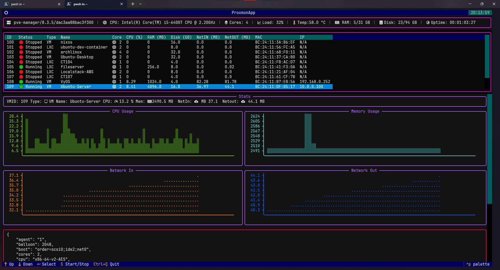

# Proxmon

Proxmox monitoring CLI tool with Textual-based TUI


## Features

- Monitor Proxmox nodes and VMs from the command line
- Display resource usage such as CPU, memory, and storage
- Fetch and display VM statuses in real-time
- Interactive TUI with keyboard shortcuts
- Start/stop VMs and LXC containers
- Real-time performance charts and statistics
- Lightweight and easy to use

## Requirements

- Python 3.12 or higher
- Proxmox VE server with API access
- SSH access to the Proxmox node

## Installation

### Option 1: Install from Source (Development)

1. Clone the repository:

   ```bash
   git clone https://github.com/Sr-vZ/Proxmon.git
   cd Proxmon
   ```

2. Install the package in development mode:
   ```bash
   pip install -e .
   ```

### Option 2: Install from Wheel

1. Build the package:

   ```bash
   python -m build
   ```

2. Install the wheel:
   ```bash
   pip install dist/proxmon-0.1.0-py3-none-any.whl
   ```

### Option 3: Install Dependencies Only

If you prefer to run from source without installing the package:

1. Clone the repository:

   ```bash
   git clone https://github.com/Sr-vZ/Proxmon.git
   cd Proxmon
   ```

2. Install dependencies:
   ```bash
   pip install -r requirements.txt
   ```

## Configuration

Create a `.env` file in your home directory or current working directory with the following variables:

```env
PROXMOX_HOST=https://your-proxmox-host:8006
TOKEN_ID=your_token_id
TOKEN_SECRET=your_token_secret
NODE=your_node_name
SSH_HOST=your-proxmox-host
SSH_PORT=22
SSH_USER=your_username
SSH_PASSWORD=your_password
```

### Setting up Proxmox API Token

1. Log into your Proxmox web interface
2. Go to **Datacenter** → **Permissions** → **API Tokens**
3. Create a new token with appropriate permissions
4. Use the token ID and secret in your `.env` file

## Usage

After installation, run the application:

```bash
proxmon
```

### Keyboard Shortcuts

- **↑/↓**: Navigate through VM/LXC list
- **Enter**: Select VM/LXC for detailed view
- **S**: Start/Stop selected VM or LXC container
- **Ctrl+Q**: Quit the application

## Dependencies

The package automatically installs the following dependencies:

- **paramiko** (SSH connections)
- **psutil** (system monitoring)
- **python-dotenv** (environment variables)
- **readchar** (keyboard input)
- **requests** (HTTP requests)
- **rich** (rich text formatting)
- **textual** (TUI framework)

## Demo

Here is a quick demo of Proxmon in action:
[https://github.com/Sr-vZ/Proxmon/blob/main/assets/Proxmon_Demo.mp4](https://github.com/Sr-vZ/Proxmon/raw/refs/heads/main/assets/Proxmon_Demo.mp4)

## Troubleshooting

### Common Issues

1. **Connection refused**: Check your Proxmox host URL and ensure the API is accessible
2. **Authentication failed**: Verify your API token credentials in the `.env` file
3. **SSH connection failed**: Ensure SSH credentials are correct and the service is running
4. **Permission denied**: Make sure your API token has sufficient permissions for the operations you're trying to perform

### Running from Source (without package installation)

If you prefer to run directly from source without installing the package:

```bash
cd Proxmon
python -m proxmon.main
```

## Contributing

Contributions are welcome! Please fork the repository and submit a pull request.

1. Fork the repository
2. Create a feature branch (`git checkout -b feature/amazing-feature`)
3. Commit your changes (`git commit -m 'Add some amazing feature'`)
4. Push to the branch (`git push origin feature/amazing-feature`)
5. Open a Pull Request

## License

This project is licensed under the MIT License. See the [LICENSE](LICENSE) file for details.
